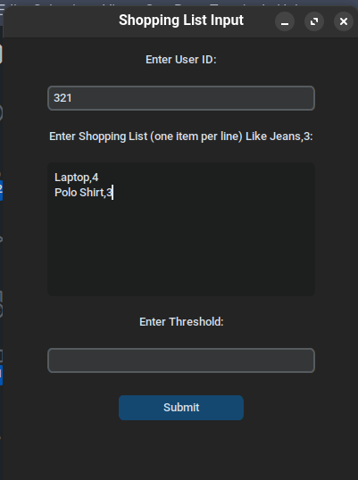

# User level

# Store level

In this Header file we have merge_result function and the main_store.

Main store runs the program of Store level childs! (For better understanding see the below image to get the levels!)

Main store create a 2 pipe for each child one for writing and one for reading also it will iterate over the folders and fork a child for each directory (refer to category level!)

after forking childs it will wait for the massages of category level childs!

after getting the massages it will merge them using the merge_result that will decode each massage and combine the items!

then it will encode the result and send it to upper level!

The user level after some processing will return the result to the store level and store level will send it to the childs!

after that it will wait untill all childs exit. at the end it will free the resources and pipes!

# Category level

# Thread level

This header file has these functions :

- Write_log : gets a massage and lock the category log semaphore to write in the log file
- check_forHit : after reading the item it will check to see if the item is in the user wanted list!
- edit_file: this function will edit the item file if the user purchased the item!
- writer_problem and reader_problem : In multi user we have a writer and reader problem so i used the solution (Without starvation ) to manage the critical section
- extract_file : this function will read the item file and extract the result from it
- read_line : Simply read a line from file!

### Runner function

This function gets a path from upper level and file the number of store and number of the file to open the shared memory that contains semaphore and a int for reader writer problem! (Refer to the Shared memory for allocation of shared memory)

after openning the semaphores and shared memory it will call the main thread function

### Main thread

in this function we will read an item from the file with reader problem . reader_problem function gets three semaphore and shared int  for handeling the critical section. I encourage you to read the code to get better underestanding. In reader_problem critical section it will call extract_file function. this function will read the file line by line and extract all the data to a item struct . also it will return the entity for further checking.

Back to the main thread, after reader problem we will call check for hit that will return index of that item or if that item is not in user wanted list it will return -1. after that we will check if we dont have that much the user want or the hit is -1 then we have no hit! and also check_for hit will call the writer_log function that will write log like userid_orderid.log that threads write their result!

Also we have 2 semaphore called sem_process and sem_thread that are init with 0 to sync the thread with the Category level process. after finding the result threads will post on sem_process and wait on sem_thread to get the result from upper level.

the category level has a global recipt struct that threads will put their result in that. to manage this critical section we used put_result semaphore ( Like a mutex lock) to add the new item in recipt!

at the end if the end_massage ( Also it is a global variable for threads ) is SUCCESS it will use the writer problem to edit the file! writer_problem has 2 semaphores. it will call another function in the critical section called edit_file this function will read the file and change the score time and also entity and write it again!

# Database

# Encoding

The encoding header has two encoding fucntion and two decode fuction. because we use pipe so we can only send string between process so i use the encoding and decoding function to read the string and cast it to item (Or score ) and also the decode function will read an item ( or scores ) and encode them to a string.

The encoding process use a general idea of comma seprate values! first it will says that i have n item and them it will send each item for example 2,Jeans,score,price,count

we will send the count that user wanted because the items will not be recived or encode as the user wanted for example the second item in user wanted list is jeans but the thread find it first!

# Shared memory!

To manage multi user we used shared memory! in shared memory as mentioned in thread level we will share 4 semaphore and one int for each file! so it will use a string like sem_mutex<#store><#file> to distingushed each file.

The init code will init the shared memory after using the project make sure to run the clean up. for making it more easy to run these two code we used a simple bash script that you can run it and passing the setup to run the init and by passing nothing it will run the clean up! (Server.bash)

# How to use it ?!

We used python to run the gui! (You can read it its simple , only needs customtkinter that you can download it using pip). it will read the input from user and then after clicking the submit it will run the c program and a terminal will be created to show the result and logs!.

To use the program you can simply run the Gui.py and enter a int for userid and your shopping list like this

Jeans,4

Polo shirt,5

after that you can set a threshold or leave it empty if you are rich!

only make sure the latest version of main.c is compiled!

# General idea of Levels!

As you can see in this image it is the general idea of Levels!
